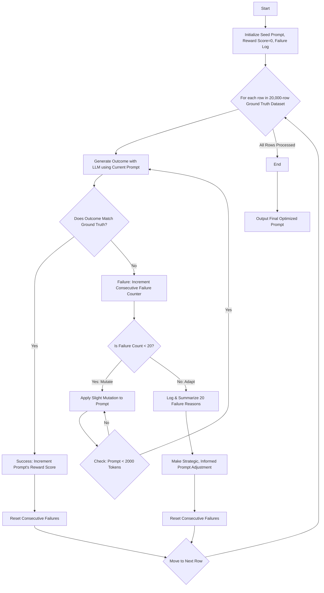

# AI Genetic Viral Prompt Evolution 🧬 

Prompt engineering is often described as a dark art. Crafting the perfect set of instructions to reliably get the desired output from a Large Language Model (LLM) can feel like a mix of intuition, guesswork, and endless trial and error. But what if we could apply a scientific, data-driven process to this challenge? What if we could *evolve* the perfect prompt automatically?

In this post, we'll explore a novel algorithm that does just that. Inspired by the principles of genetic mutation and viral evolution, this system iteratively refines an LLM prompt against a ground-truth dataset, automatically discovering the most effective instructions.

We'll walk through the entire project, built to run on **IBM watsonx.ai**. You'll get the full project structure, all the Python code, and a step-by-step guide to run it yourself.

-----

## The Core Concept: How It Works

At its heart, the algorithm treats a prompt as a “genome” — a set of instructions that can be tested for fitness, mutated, and improved over generations. The process is visualized in the flowchart below, which outlines the logical steps of the evolution.



### Evolutionary Journey 🧬

  * **Initialization** – We start with a `Seed Prompt`, a `Reward Score` of 0, and an empty `Failure Log`.
  * **Environment** – The system iterates through a large `Ground Truth Dataset`, which provides the challenges to test our prompt's fitness.
  * **Test** – For each row, the current prompt is used to `Generate an Outcome` from the LLM.
  * **Fitness Check**:
      * **Success** → The prompt's `Reward Score` is incremented, and the system moves to the next row, keeping the successful prompt.
      * **Failure** → The `Consecutive Failure Counter` for the current row is incremented.
  * **Micro-evolution (The "Mutate" Loop)** – If the failure count is less than 20, the system applies a `Slight Mutation` to the prompt and retries the *same row*. This allows for minor adjustments to overcome a specific hurdle.
  * **Macro-evolution (The "Adapt" Path)** – After 20 straight failures on one row, a deeper learning process is triggered. The system will `Log & Summarize` the reasons for the 20 failures. Based on this summary, it makes a `Strategic, Informed Prompt Adjustment` before moving to the next row.
  * **Champion** – After processing all rows, the algorithm outputs the `Final Optimized Prompt`—the one that proved most successful.

-----

## Project Structure 📁

Organize your project directory as follows for the script to work correctly.

```
prompt-evolver-watsonx/
├── .env
├── config_watsonx.toml
├── my_data.csv
├── prompt_evolver_watsonx.py
└── evolution_out_watsonx/
    ├── champion_prompt.txt
    └── reward_log.csv
```

  * `.env` → Watsonx credentials (never commit this).
  * `config_watsonx.toml` → All tunables (classes, prompt skeleton, evolution limits).
  * `my_data.csv` → Your GT dataset with `payload` & `truth` columns.
  * `prompt_evolver_watsonx.py` → The async engine.
  * `evolution_out_watsonx/` → Auto-generated results.

-----

## The Codebase

The following files provide a concrete and powerful implementation of the conceptual architecture described above.

### 1\. Configuration (`config_watsonx.toml`)

This TOML file holds all the tunable parameters for your experiment.

```toml
[data]
classes = ["A","B","C","D"]

[genome]
header  = "You are a strict classifier. Answer with a single letter."
context = """
EX1 -> A
EX2 -> B
EX3 -> D
"""
query   = "Predict the class for the row: {{ROW}}"

[evolver]
max_prompt_tokens = 2000
max_tries   = 20
fail_memory = 20
```

### 2\. Environment Variables (`.env`)

Create this file to store your credentials securely.

```
# Watsonx credentials  (KEEP PRIVATE)
WATSONX_PROJECT_ID=xxxxxxxx-xxxx-xxxx-xxxx-xxxxxxxxxxxx
WATSONX_API_KEY=************************
WATSONX_API_URL=https://us-south.ml.cloud.ibm.com
```

### 3\. The Engine (`prompt_evolver_watsonx.py`)

This is the complete, fully asynchronous Python script. It implements the logic from the flowchart, using specific techniques like an `immunity` counter to fulfill the "Log & Summarize" step and a mutator probability adjustment for the "Strategic Adjustment" step.

```python
#!/usr/bin/env python3
"""
Genetic-Viral Prompt Evolver  –  Watson X edition
Author: ruslanmv.com – 2025-06-23
"""

from __future__ import annotations
import asyncio, os, sys, random, re, hashlib, tomllib, pathlib
from collections import Counter
from dataclasses import dataclass, replace
from typing import Dict, List, Tuple, Any

import pandas as pd
import numpy as np
import tiktoken
from dotenv import load_dotenv

# ── Watsonx.ai wiring ──────────────────────────────────────────────────────
try:
    from beeai_framework.adapters.watsonx import WatsonxChatModel
    from beeai_framework.backend import UserMessage, ChatModel
    from beeai_framework.errors import FrameworkError
except ImportError:
    print("❌  beeai_framework not installed.  `pip install beeai_framework`",
          file=sys.stderr)
    sys.exit(1)

BASE_DIR = pathlib.Path(__file__).resolve().parent
load_dotenv(BASE_DIR / ".env")

SEM = asyncio.Semaphore(8)  # Watsonx: 8 queries per second

try:
    CHAT: ChatModel = WatsonxChatModel(
        model_id="meta-llama/llama-4-maverick-17b-128e-instruct-fp8",
        settings={
            "temperature": 0.1,
            "top_p": 0.9,
            "project_id": os.getenv("WATSONX_PROJECT_ID"),
            "api_key":    os.getenv("WATSONX_API_KEY"),
            "api_base":   os.getenv("WATSONX_API_URL"),
        },
    )
except FrameworkError as e:
    print(f"❌  Cannot init WatsonxChatModel: {e.explain()}", file=sys.stderr)
    sys.exit(1)

async def watsonx_call(prompt: str) -> str:
    """Rate-limited chat call."""
    async with SEM:
        try:
            resp = await CHAT.create(messages=[UserMessage(prompt)])
            return resp.get_text_content().strip()
        except FrameworkError as e:
            print("Watsonx error:", e.explain(), file=sys.stderr); return ""
        except Exception as e:
            print("Unexpected Watsonx error:", e, file=sys.stderr);  return ""

# ── Config ────────────────────────────────────────────────────────────────
CFG = tomllib.loads((BASE_DIR / "config_watsonx.toml").read_text())
ENC = tiktoken.encoding_for_model("gpt-3.5-turbo")  # rough length estimate

# ── Genome dataclass ──────────────────────────────────────────────────────
@dataclass(frozen=True)
class Genome:
    header: str; context: str; payload: str; query: str

    def render(self) -> str:
        return "\n\n".join([self.header, self.context, self.payload, self.query])

    def token_len(self) -> int:
        return len(ENC.encode(self.render()))

    # ---- Evolutionary operators -----------------------------------------
    def mutate(self, immunity: Counter) -> "Genome":
        ops, probs = zip(*[(k, v["p"]) for k, v in MUTATORS.items()])
        probs = np.array(probs, dtype=float)
        for i, op in enumerate(ops):
            probs[i] *= 0.5 ** immunity[op]  # immunity penalty
        probs /= probs.sum()
        op = np.random.choice(ops, p=probs)
        return MUTATORS[op]["fn"](self)

    def hash(self) -> str:
        return hashlib.sha1(self.render().encode()).hexdigest()[:10]

# ── Mutation operators ────────────────────────────────────────────────────
def synonym_flip(g: Genome) -> Genome:
    verbs = ["Predict", "Provide", "Return", "Classify", "Identify"]
    return replace(g, query=re.sub(r"^\w+", random.choice(verbs), g.query))

def example_dropout(g: Genome) -> Genome:
    blocks = g.context.split("\n\n")
    if len(blocks) > 1:
        blocks.pop(random.randrange(len(blocks)))
    return replace(g, context="\n\n".join(blocks))

def temp_tweak(g: Genome) -> Genome:
    if "temperature=" in g.query:
        q = re.sub(r"temperature=\d(\.\d+)?", "temperature=0.0", g.query)
    else:
        q = f"{g.query} temperature=0.0"
    return replace(g, query=q)

MUTATORS: Dict[str, Dict[str, Any]] = {
    "synonym_flip":   {"p": .30, "fn": synonym_flip},
    "example_dropout":{"p": .40, "fn": example_dropout},
    "temp_tweak":     {"p": .30, "fn": temp_tweak},
}

# ── LLM helpers ───────────────────────────────────────────────────────────
async def classify(prompt: str, row_payload: str) -> str:
    return await watsonx_call(prompt.replace("{{ROW}}", row_payload))

def post_process(raw: str) -> str:
    raw = raw.lower()
    for c in CFG["data"]["classes"]:
        if c.lower() in raw: return c
    return "UNKNOWN"

async def diagnose_failure(raw: str, truth: str) -> str:
    diag = await watsonx_call(
        f"You produced: {raw}\nCorrect: {truth}\n"
        "Give the main reason (≤5 words).")
    return diag or "unknown_cause"

def reward(attempt: int) -> float:  # 1/attempt
    return 1.0 / attempt

# ── Evolution loop ────────────────────────────────────────────────────────
async def evolve(seed: Genome, df: pd.DataFrame) -> Tuple[Genome, List[float]]:
    champ, genome = seed, seed
    rewards: List[float] = []
    immunity = Counter(); consec_fail = 0

    for idx, row in df.iterrows():
        print(f"Row {idx+1}/{len(df)}")
        for attempt in range(1, CFG["evolver"]["max_tries"] + 1):
            pred = post_process(await classify(genome.render(), row["payload"]))
            if pred == row["truth"]:
                rewards.append(reward(attempt)); consec_fail = 0
                champ = genome; break
            # ---- failure branch: implements the "No" path from the flowchart
            consec_fail += 1
            # This 'immunity' counter is our implementation of the "Log" step
            immunity[await diagnose_failure(pred, row["truth"])] += 1
            # This is the "Slight Mutation" step
            genome = genome.mutate(immunity)
            while genome.token_len() > CFG["evolver"]["max_prompt_tokens"]:
                genome = genome.mutate(immunity)
            # This implements the "Adapt" path after 20 failures
            if consec_fail >= CFG["evolver"]["fail_memory"]:
                adjust_mutator(immunity); immunity.clear(); consec_fail = 0; break
        else:
            rewards.append(0.0)  # exhausted attempts
    return champ, rewards

# ── Mutator adjustment ────────────────────────────────────────────────────
def adjust_mutator(fails: Counter):
    """This function is our implementation of the "Strategic Adjustment" step."""
    if not fails: return
    tot = sum(fails.values())
    for op, cnt in fails.items():
        # Heuristic: if a failure reason is highly correlated, adjust a related operator
        # This part is simple; a more complex mapping could be built.
        related_op = "example_dropout" if "example" in op else "synonym_flip"
        if related_op in MUTATORS and cnt / tot >= 0.6:
            MUTATORS[related_op]["p"] *= 0.5
            
    s = sum(v["p"] for v in MUTATORS.values())
    for v in MUTATORS.values(): v["p"] /= s

# ── CLI ───────────────────────────────────────────────────────────────────
async def _async_main(dataset: str):
    df = pd.read_csv(dataset)
    seed = Genome(CFG["genome"]["header"], CFG["genome"]["context"],
                  "{{ROW}}", CFG["genome"]["query"])
    champ, rewards = await evolve(seed, df)
    out = BASE_DIR / "evolution_out_watsonx"; out.mkdir(exist_ok=True)
    (out / "champion_prompt.txt").write_text(champ.render())
    pd.DataFrame({"reward": rewards}).to_csv(out / "reward_log.csv", index=False)
    print("\n🏆 Champion hash:", champ.hash(), "Total reward:", f"{sum(rewards):.2f}")

def main():
    import argparse, os
    p = argparse.ArgumentParser(description="Evolve LLM prompts with a genetic/viral algorithm.")
    p.add_argument("--dataset", required=True, help="Path to your ground-truth CSV file.")
    args = p.parse_args()
    if not os.path.exists(args.dataset):
        print(f"❌ Dataset not found: {args.dataset}", file=sys.stderr); sys.exit(1)
    asyncio.run(_async_main(args.dataset))

if __name__ == "__main__": main()
```

-----

## Quick Start 🚀

Follow these steps to run the experiment.

#### 1 – Install dependencies

```bash
pip install beeai_framework ibm-watsonx pandas numpy tiktoken python-dotenv
```

#### 2 – Load Watsonx credentials

For **macOS / Linux**:

```bash
export $(grep -v '^#' .env | xargs)
```

For **Windows PowerShell**:

```powershell
Get-Content .env | Where-Object {$_ -notmatch "^#"} | ForEach-Object { $name, $value = $_ -split '=', 2 ; Set-Item "env:$name" -Value $value }
```

#### 3 – Run the evolver

Point the script to your dataset and let it run.

```bash
python prompt_evolver_watsonx.py --dataset my_data.csv
```

Outputs will land in the `evolution_out_watsonx/` directory:

| File | What it is |
| :--- | :--- |
| **`champion_prompt.txt`** | The fittest prompt genome. |
| **`reward_log.csv`** | Per-row reward curve — ready for plotting. |

-----

## Beyond the Basics 🧪

This framework is built to be extended. Here are a few ideas:

  * **Smarter rewards** – use cosine-similarity between embeddings for partial credit.
  * **Parallel lineages** – spawn multiple processes sharing a Redis “immunity” buffer.
  * **Richer mutations** – inject schema hints, reorder headers, or let the LLM rewrite itself.
  * **Dashboard** – plot `reward_log.csv` in Grafana to watch evolution live.

This evolutionary approach transforms prompt engineering from a manual chore into an automated, data-driven optimisation problem. Happy tinkering\! 🐣